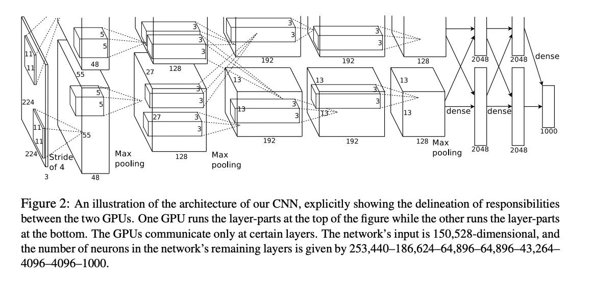

# [ImageNet Classification with Deep Convolutional Neural Networks **Krizhevsky, Sutskever & Hinton (2012)** — AlexNet (ImageNet breakthrough)](http://papers.neurips.cc/paper/4824-imagenet-classification-with-deep-convolutional-neural-networks.pdf)

MNIST has low error rate(<0.3%), but we need to apply on real data, so need to apply on real world data
hence need more less error rate

therefore we need a model with a large learning capacity. 
However, the immense complexity of the object recognition task means that this problem cannot be specified even by a dataset as large as ImageNet, so our model should also have lots of prior knowledge to compensate for all the data we don’t have.

compared to standard feedforward neural networks with similarly-sized layers, CNNs have much fewer connections and parameters and so easy to train, while their theoretically-best performance is likely to be only slightly worse.

wrote a highly optimised gpu for implementation of 2D convolution

but overfitting problem due to size of data
Our final network contains five convolutional and three fully-connected layers, and 
this depth seems to be important: 
    we found that removing any convolutional layer (each of which contains no more than 1% of the model’s parameters) resulted in inferior performance.

**DataSet**
- 15 million labeled high-resolution images belonging to roughly 22,000 categories. 
- variable resolution so down-sample to 256x256 size
- original [dataset](https://www.kaggle.com/datasets/dimensi0n/imagenet-256) is of 7.68 gb(not possible here)

## Architecture

**ReLU Nonlinearity**

output of function of x, is modelled using saturatinf nonlinearity like: $f(x)= tanh(x)$ or  $f(x) = (1 + e^{−x})^{−1}$. 

However non-saturating nonlinearities ReLU like: $f(x)=max(0,x)$, enables faster training.
A four-layer convolutional neural network with ReLUs reaches a $25%$ training error rate on CIFAR-10 six times faster than an equivalent network with tanh neurons(dashed line).

**Training on Multiple GPU**
1 gpu can't do that possibly, so use 2 with cross-GPU parallelization
parallelizaton: puts half of the kernels (or neurons) on each GPU, with one additional trick: the GPUs communicate only in certain layers
kernels of layer 3 take input from all kernel maps in layer 2; but kernels in layer 4 take input only from those kernel maps in layer 3 which reside on the same GPU.

**Local Response Normalization (LRN)**
- Normalizes neuron outputs across nearby channels to improve generalization.
- The normalized output is given by:
  $b_{x,y}^i = a_{x,y}^i / \left( k + \alpha \sum_{j=max(0,i-n/2)}^{min(N-1,i+n/2)} (a_{x,y}^j)^2 \right)^{\beta}$
- LRN reduces error rates(13% to 11%) and encourages competition among neurons, helping CNNs learn better.

    $k=2, n = 5, \alpha = 10−4, and \beta = 0.75$

**Overlapping Pooling**
- Pooling layers summarize outputs of neighboring neurons in CNNs.
- Traditional pooling: stride $s = z$ (no overlap); overlapping pooling: stride $s < z$ (with overlap).
- Overlapping pooling ($s=2$, $z=3$) reduces top-1 and top-5 error rates by 0.4% and 0.3% compared to non-overlapping pooling ($s=2$, $z=2$), with similar output dimensions.

**Overall Architecture (AlexNet)**
- 8 layers with weights: 5 convolutional, 3 fully-connected.
- Uses 1000-way softmax for classification; maximizes multinomial logistic regression objective.
- Layers are distributed across 2 GPUs, communicating only at certain layers.
- Response normalization and max-pooling applied after first, second, and fifth convolutional layers.
- ReLU applied to all convolutional and fully-connected layers.
- Layer details: first conv layer uses 96 kernels (11x11x3, stride 4), second uses 256 (5x5x48), third uses 384 (3x3x256), fourth uses 384 (3x3x192), fifth uses 256 (3x3x192), fully-connected layers have 4096 neurons each.

**Reducing Overfitting**
- Data augmentation: increases dataset size by creating new images via translations, reflections, and color/intensity changes. This helps the model generalize and reduces top-1 error by over 1%.
- Dropout: randomly disables neurons during training (probability 0.5), forcing the network to learn robust features and preventing overfitting. At test time, all neurons are used but outputs are scaled by 0.5.
- Both techniques help AlexNet avoid overfitting and improve performance on large datasets.

## Details of Learning
- Used stochastic gradient descent with momentum (0.9), batch size 128, and weight decay (0.0005).
- Weights initialized with small random values; biases set to 1 for some layers to help ReLU activation.
- Training took 5–6 days on two GPUs, with learning rate manually reduced as needed.

**Results**
- AlexNet achieved top-1 and top-5 error rates of 37.5% and 17.0% on ILSVRC-2010, outperforming previous methods.
- Averaging predictions from multiple CNNs further reduced error rates; best result was 15.3% top-5 error on ILSVRC-2012.
- Qualitative evaluations show the network learns meaningful features and can retrieve visually similar images using hidden layer activations.

------

[**Project:** Create an image classifier using CNNs](./init.py)