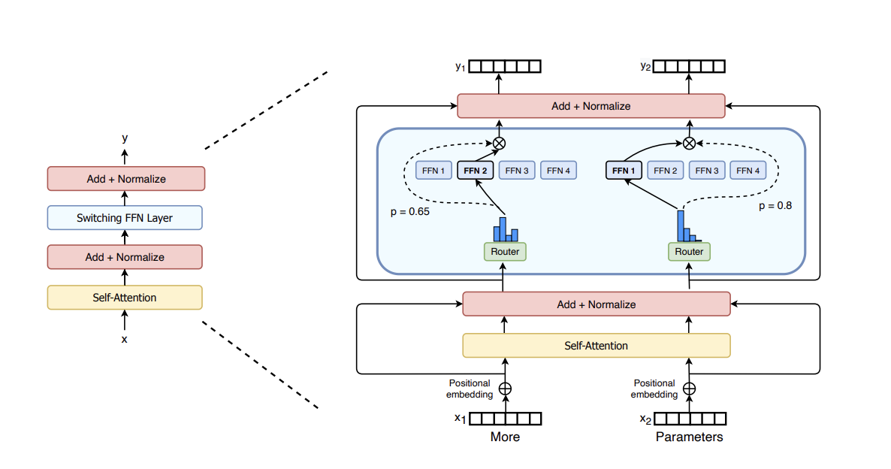

# [Switch Transformers: Scaling to Trillion Parameter Models with Simple and Efficient Sparsity](https://arxiv.org/pdf/2101.03961)

Basically Mixture of Expert architecture.

Switch Transformer: improves over MoE architecture

Improved training over limited resources.

Reduce model size by 99%, while preserving 30% quality gains

Improved training techniques: selective precision training allowed with lower float16 precision; allows to scale to large no of mix of expert; increased expert regularization that improves sparse model fine-tuning and multi-task training.

Improvement over multiple languages

model scaling increased by upto trillion parameter.

# Switch Transformers

Benefits of scaling was studied by some researchers which uncovered powerlaw scaling with `model size`, `data set size` and `computational budget`.
They suggested that raining large models on relatively small amounts of data is the computationally optimal approach.

let's check a 4th axis:  increase the *parameter count* while keeping the floating point operations (FLOPs) per example constant.

Our hypothesis is
that the parameter count, independent of total computation performed, is a separately
important axis on which to scale. We achieve this by designing a sparsely activated model
that efficiently uses hardware designed for dense matrix multiplications such as GPUs and
TPUs. Our work here focuses on TPU architectures, but these class of models may be
similarly trained on GPU clusters. In our distributed training setup, our sparsely activated
layers split unique weights on different devices. Therefore, the weights of the model increase
with the number of devices, all while maintaining a manageable memory and computational
footprint on each device.

##  Simplifying Sparse Routing
